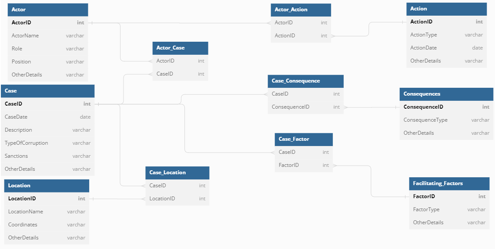
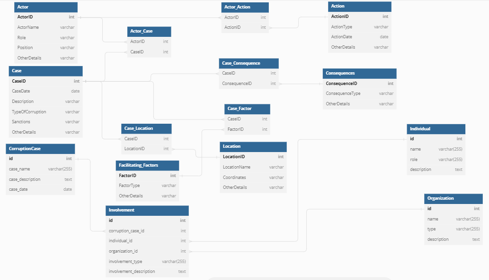

# Detailed Data Model

This document provides a detailed description of the data model used in our corruption case analysis system. It includes a description of each entity and attribute, the data types used, and the relationships between the entities.

## Entities and Attributes

1. **Case:** 
    - CaseID (integer): A unique identifier for the case.
    - CaseDate (date): The date of the case.
    - Description (text): A brief description of the case.
    - TypeOfCorruption (text): The type of corruption involved in the case.
    - Sanctions (text): The sanctions imposed in the case.
    - OtherDetails (text): Any other relevant details about the case.

2. **Actor:** 
    - ActorID (integer): A unique identifier for the actor.
    - ActorName (text): The name of the actor.
    - Role (text): The role of the actor in the case (e.g., perpetrator, victim, investigator).
    - Position (text): The position of the actor (e.g., public official, private sector employee).
    - OtherDetails (text): Any other relevant details about the actor.

3. **Location:** 
    - LocationID (integer): A unique identifier for the location.
    - LocationName (text): The name of the location.
    - Coordinates (text): The geographical coordinates of the location.
    - OtherDetails (text): Any other relevant details about the location.

4. **Action:** 
    - ActionID (integer): A unique identifier for the action.
    - ActionType (text): The type of action (e.g., bribe, fraud, embezzlement).
    - ActionDate (date): The date of the action.
    - OtherDetails (text): Any other relevant details about the action.

5. **Facilitating Factors:**
    - FactorID (integer): A unique identifier for the facilitating factor.
    - FactorType (text): The type of facilitating factor (e.g., lack of transparency, lack of accountability).
    - OtherDetails (text): Any other relevant details about the facilitating factor.

6. **Consequences:**
    - ConsequenceID (integer): A unique identifier for the consequence.
    - ConsequenceType (text): The type of consequence (e.g., deterioration of public services, weakening of trust in institutions).
    - OtherDetails (text): Any other relevant details about the consequence.

## Relationships

1. **Involved In:** This relationship connects actors to cases. It indicates that an actor was involved in a specific case.

2. **Occurs At:** This relationship connects cases to locations. It indicates that a case occurred at a specific location.

3. **Performs:** This relationship connects actors to actions. It indicates that an actor performed a specific action in a corruption case.

4. **Facilitated By:** This relationship connects cases to facilitating factors. It indicates that a case was facilitated by a specific factor.

5. **Results In:** This relationship connects cases to consequences. It indicates that a case resulted in a specific consequence.

Please note that this is a high-level overview of the data model. The actual implementation may include additional entities, attributes, and relationships to accommodate specific requirements and constraints.

