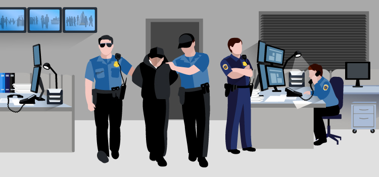

# CrimeScope Analytics Platform

## Overview

CrimeScope Analytics Platform is an advanced analytical tool designed to aid law enforcement agencies in crime data analysis and prediction. It integrates data from various sources into a unified database, allowing for complex queries and in-depth crime pattern analysis.

## Table of Contents

1. [Problem Statement and Requirements](content/Problem_Statement_and_Requirements.md)
2. [Conceptual Design](content/Conceptual_Design.md)
3. [Data Model](content/Data_Model.md)
4. [Database Implementation](content/Database_Implementation.md)
5. [Queries](content/Queries.md)
6. [Future Work](content/Future_Work.md)

## Getting Started

To get started with CrimeScope Analytics Platform, please follow the instructions in the [Installation Guide](content/Installation_Guide.md).

## Usage

For details on how to use the platform, refer to the [User Guide](content/User_Guide.md).

## Contributing

We welcome contributions to the CrimeScope Analytics Platform.

## License

This project is licensed under the [LICENSE](content/LICENSE.md) - see the [License](content//License.md) file for details.

## Acknowledgments

* Thanks to all the data providers for making their datasets publicly available.
* Appreciation to the law enforcement agencies for their guidance.
* Gratitude to the development team and contributors who have worked on this project.

## Contact

For any inquiries, please reach out to [nelson.sanchez@uniandes.edu.co](mailto:nelson.sanchez@uniandes.edu.co).

