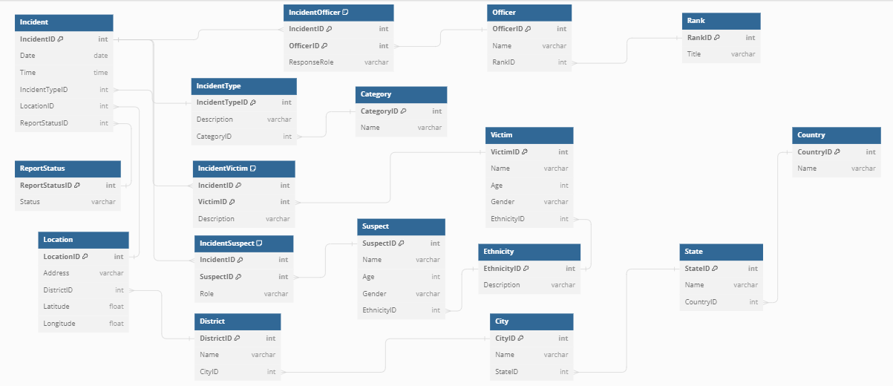

# Data Model

## Introduction

The data model for the CrimeScope Analytics Platform was meticulously crafted to ensure minimal redundancy and maximum data integrity. Adhering to the third normal form (3NF), the model is designed to accurately represent the complex relationships found within crime data while providing a scalable and efficient database structure.

## Entities and Attributes

Our data model consists of several key entities, each with a set of carefully chosen attributes to capture the necessary details for comprehensive crime analysis:

### Incident
- **IncidentID**: A unique identifier for each incident.
- **Date**: The date on which the incident occurred.
- **Time**: The time at which the incident occurred.
- **IncidentTypeID**: A reference to the type of incident.
- **LocationID**: A reference to the location where the incident took place.
- **ReportStatusID**: A reference to the current status of the incident report.

### Suspect
- **SuspectID**: A unique identifier for each suspect.
- **Name**: The name of the suspect.
- **Age**: The age of the suspect.
- **Gender**: The gender of the suspect.
- **EthnicityID**: A reference to the ethnicity of the suspect.

### Victim
- **VictimID**: A unique identifier for each victim.
- **Name**: The name of the victim.
- **Age**: The age of the victim.
- **Gender**: The gender of the victim.
- **EthnicityID**: A reference to the ethnicity of the victim.

### Officer
- **OfficerID**: A unique identifier for each officer.
- **Name**: The name of the officer.
- **RankID**: A reference to the rank of the officer.

### Additional entities include `Location`, `IncidentType`, `ReportStatus`, `Ethnicity`, and `Rank`, each with attributes that provide further context and detail to the associated entity.

## Relationships

The relationships between entities reflect the real-world interactions and complexities of crime data:

- **Incidents to Suspects**: A many-to-many relationship, indicating that multiple suspects can be involved in a single incident and a suspect can be involved in multiple incidents.
- **Incidents to Victims**: A many-to-many relationship, showing that an incident can have multiple victims and a victim can experience multiple incidents.
- **Incidents to Officers**: A many-to-many relationship, representing the fact that multiple officers can respond to a single incident and an officer can attend to multiple incidents.

## Junction Tables

To manage the many-to-many relationships, we introduced junction tables:

- **IncidentSuspect**: Links incidents to suspects and includes additional attributes such as the role of the suspect in the incident.
- **IncidentVictim**: Connects incidents to victims and may include details about the victim's involvement.
- **IncidentOfficer**: Associates incidents with responding officers and includes information about the officer's role in the response.

## Normalization

Each entity and relationship in the model has been normalized to 3NF to ensure that:

- All attributes depend only on the primary key.
- There are no transitive dependencies.
- Data redundancy is minimized.

## Conclusion

The data model is the backbone of the CrimeScope Analytics Platform, providing a robust framework for capturing and analyzing crime data. By adhering to 3NF, the model ensures data integrity and provides a scalable structure that can accommodate the evolving needs of crime analysis.

